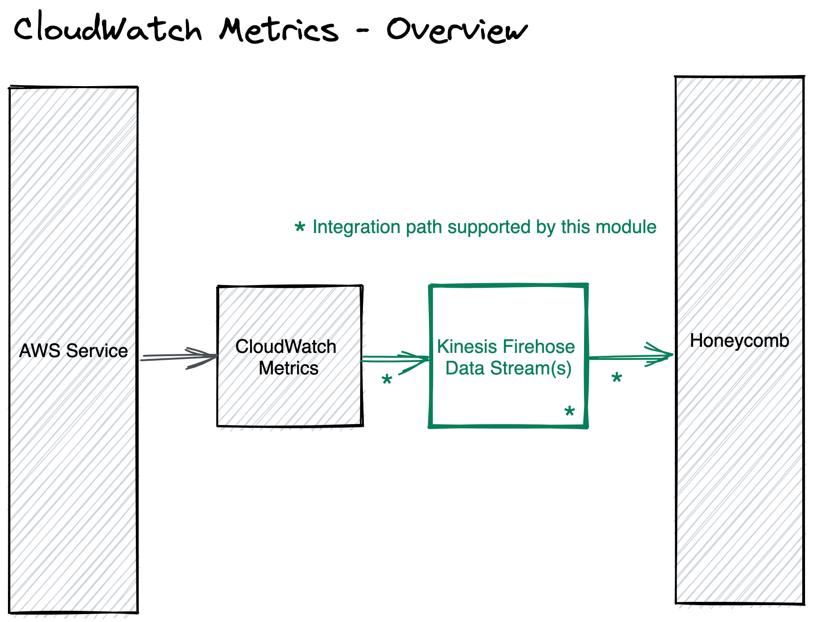

# TERRAFORM AWS CLOUDWATCH METRICS INTEGRATION

This repo contains a module for resources in [AWS](https://aws.amazon.com/) using [Terraform](https://www.terraform.io/)
to send CloudWatch Metrics to [Honeycomb](https://www.honeycomb.io/).

## How does this work?



All required resources to setup an integration pipelines to take metrics from a Cloudwatch metrics group and send them to
Honeycomb can be created and managed via this module.

## Use

The minimal config is:

```hcl
module "honeycomb-aws-cloudwatch-metrics-integration" {
  source = "honeycombio/integrations/aws//modules/cloudwatch-metrics"

  name = var.cloudwatch_metrics_integration_name // A name for the Integration.
  
  honeycomb_api_key      = var.HONEYCOMB_API_KEY // Honeycomb API key.
  honeycomb_dataset_name = "cloudwatch-metrics" // Your Honeycomb dataset name that will receive the metrics.

  s3_failure_bucket_arn = var.s3_bucket_arn // A S3 bucket that will store any metrics that failed to be sent to Honeycomb.
}
```

Set the API key used by Terraform setting the HONEYCOMB_API_KEY environment variable.

```bash
export TF_VAR_HONEYCOMB_API_KEY=$HONEYCOMB_API_KEY
```

Setup AWS credentials for the intended AWS account where the resources will be created and managed. Please see for
more [details and options](https://registry.terraform.io/providers/hashicorp/aws/latest/docs#authentication-and-configuration)
.

```bash
export AWS_ACCESS_KEY_ID=$AWS_ACCESS_KEY_ID
export AWS_SECRET_ACCESS_KEY=$AWS_SECRET_ACCESS_KEY
export AWS_DEFAULT_REGION=$AWS_DEFAULT_REGION
```

Now you can run `terraform plan/apply` in sequence.

For more config options, see [USAGE.md](https://github.com/honeycombio/terraform-aws-integrations/blob/main/USAGE.md).

## Examples

Examples of use of this module can be found
in [`examples/`](https://github.com/honeycombio/terraform-aws-integrations/tree/main/examples).

## Development

Please see [this](https://github.com/honeycombio/terraform-aws-integrations#development) for details.

## Contributions

Features, bug fixes and other changes to this module are gladly accepted. Please open issues or a pull request with your
change.

All contributions will be released under the Apache License 2.0.
