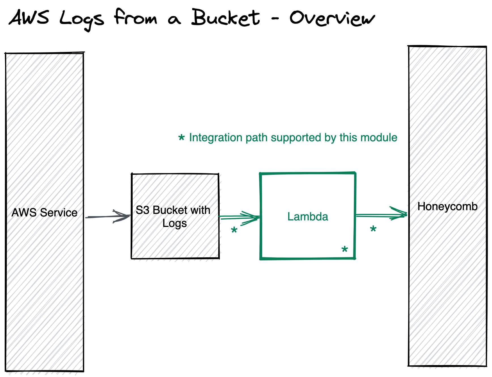

# TERRAFORM AWS S3 LOGS IN A BUCKET


This repo contains a module for resources in [AWS](https://aws.amazon.com/) using [Terraform](https://www.terraform.io/)
to send logs from an AWS S3 Bucket to [Honeycomb](https://www.honeycomb.io/).

## How does this work?



All required resources to setup an integration pipelines to take logs from a S3 bucket and send them to
Honecyomb can be created and managed via this module.


## Use

The minimal config is:

```hcl
module "logs_from_a_bucket_integrations" {
  source = "honeycombio/integrations/aws//modules/s3-logfile"
  name   = var.logs_integration_name

  parser_type   = var.parser_type // valid types are alb, elb, cloudfront, vpc-flow-log, s3-access, json, and keyval
  s3_bucket_arn = var.s3_bucket_arn     // The full ARN of the bucket storing the logs.


  honeycomb_api_key      = var.honeycomb_api_key // Your Honeycomb team's API key.
  honeycomb_dataset_name = "alb-logs" // Your Honeycomb dataset name that will receive the metrics.
}
```

Set the API key used by Terraform setting the HONEYCOMB_API_KEY environment variable.

```bash
export TF_VAR_HONEYCOMB_API_KEY=$HONEYCOMB_API_KEY
```

Setup AWS credentials for the intended AWS account where the resources will be created and managed. Please see for
more [details and options](https://registry.terraform.io/providers/hashicorp/aws/latest/docs#authentication-and-configuration)
.

```bash
export AWS_ACCESS_KEY_ID=$AWS_ACCESS_KEY_ID
export AWS_SECRET_ACCESS_KEY=$AWS_SECRET_ACCESS_KEY
export AWS_DEFAULT_REGION=$AWS_DEFAULT_REGION
```

Now you can run `terraform plan/apply` in sequence.

For more config options, see [USAGE.md](https://github.com/honeycombio/terraform-aws-integrations/blob/main/USAGE.md).

## Examples

Examples of use of this module can be found
in [`examples/`](https://github.com/honeycombio/terraform-aws-integrations/tree/main/examples/s3-logfile).

## Development

Please see [this](https://github.com/honeycombio/terraform-aws-integrations#development) for details.

## Contributions

Features, bug fixes and other changes to this module are gladly accepted. Please open issues or a pull request with your
change.

All contributions will be released under the Apache License 2.0.
